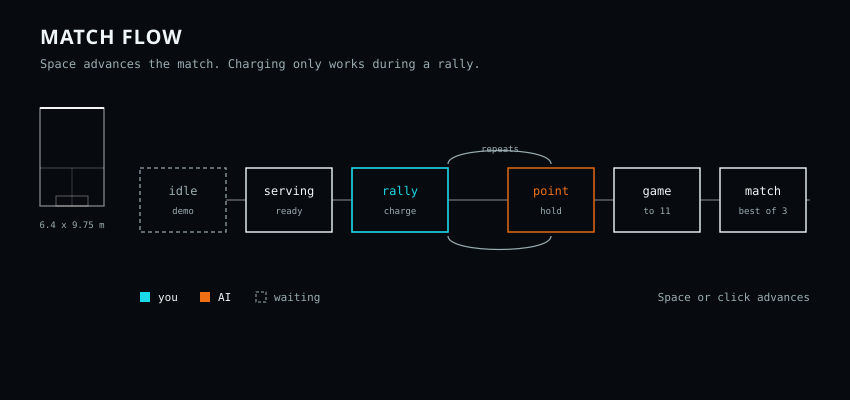
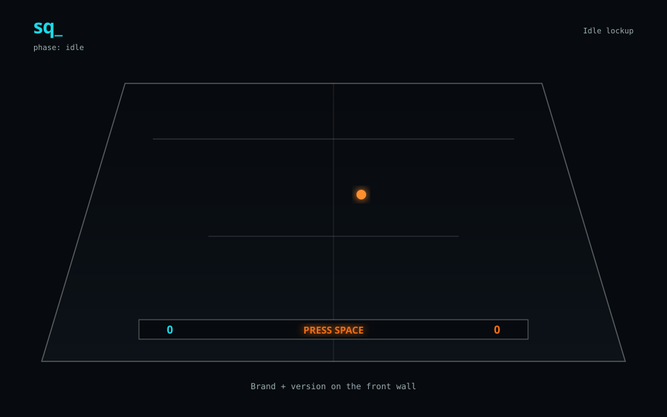
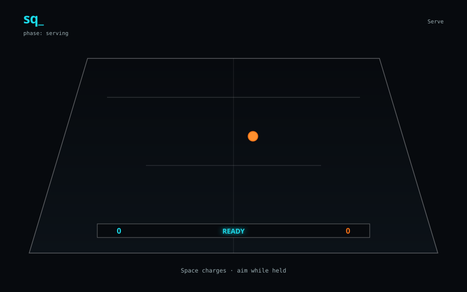
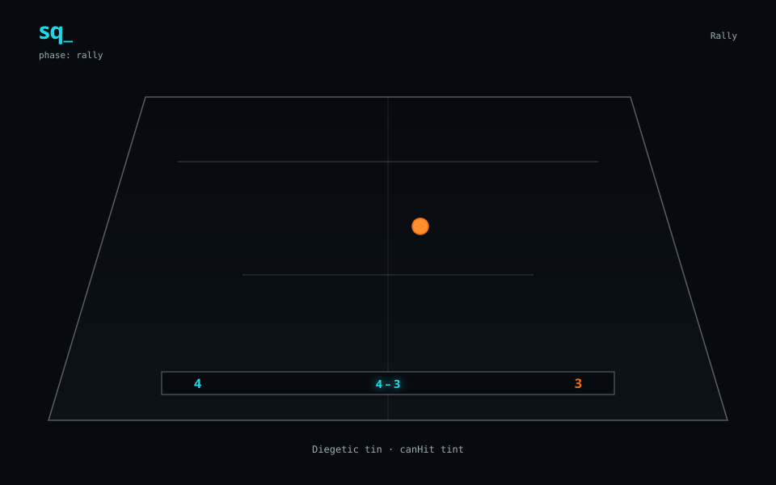
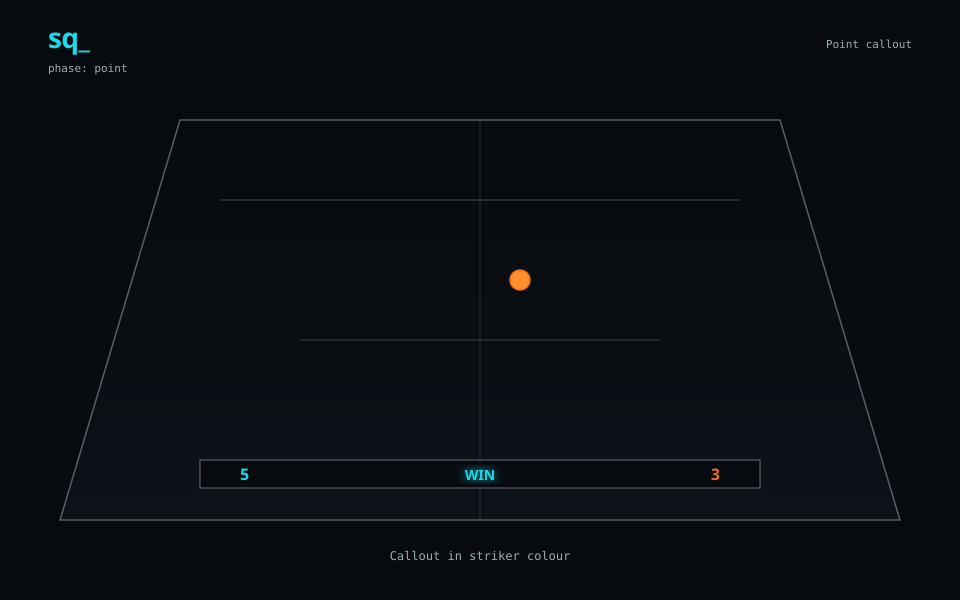
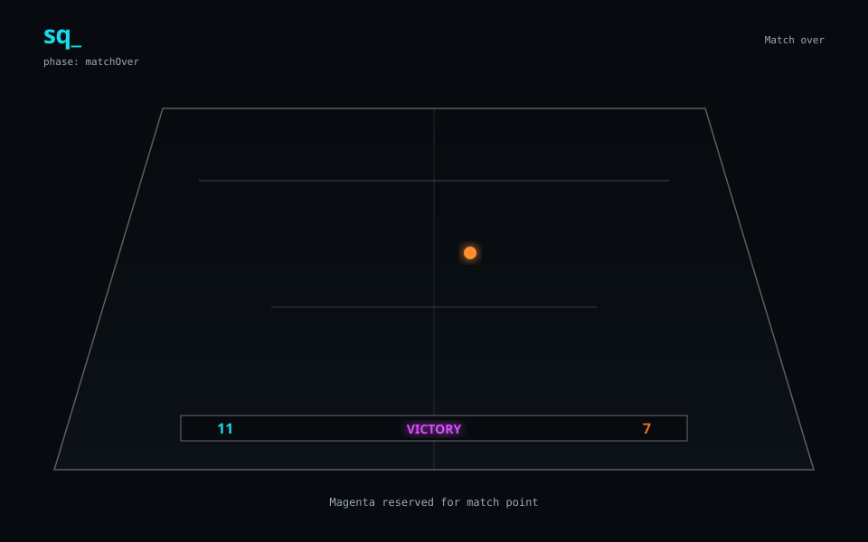

<h1 align="center">
  
</h1>

<p align="center">
<!-- x-release-please-start-version -->
<strong>Version:</strong> 0.1.3
<!-- x-release-please-end -->
</p>

<p align="center">Browser squash on a WSF court. Two buttons. The ball tells you when it is live.</p>

<p align="center">
  <a href="https://sq.perniemann.com">https://sq.perniemann.com</a>
</p>

<p align="center">
  
</p>

## Play

```bash
npm install
npm run dev
```

Open the local URL Vite prints (usually `http://localhost:5173`).

<p align="center">
  
  
  
  
  
</p>

## Two buttons, three axes

Space is not a power meter. Hold sets length. Aim X sets width. Stick Y sets attack plane.

<p align="center">
  
</p>

| Action | Mouse / keyboard | Touch |
|--------|------------------|-------|
| Start / continue / charge shot (length) | Click or **Space** / **LMB** (hold to charge, release to hit) | Tap / hold **right** half |
| Aim (width; extreme → side-first boast) / attack plane (front=above · back=below) while charging | Drag X/Y, or **A**/**D** + **W**/**S** (arrows) | Drag X/Y on **right** half |
| Chase the ball | **Shift** / **RMB** | Hold **left** half |

## Front wall makes it live

`canHit` restores only after the front wall (WSF 6.2). Side, back, and floor do not.

<p align="center">
  
</p>

Scoring is PARS-11, win by 2 at 10–10, best of 3. Full controls and scoring: [docs/HOW-TO-PLAY.md](docs/HOW-TO-PLAY.md).

## Honest edges

| Edge | What it is |
|------|------------|
| Returnability | `canHit` restores only on front-wall contact |
| Hit zone | Racquet collider and 1.2 m proximity check are oversized on purpose |
| Ball | WSF radius; mass is light for pace |
| Bundle | Rapier is most of the download |
| Scene | Re-renders more often than it should |

## Stack

Vite 6 · React 19 · React Three Fiber 9 · Three.js r182 · Rapier · Zustand 5 · TypeScript 5.7 strict · Vitest

No backend, env files, or network calls — entirely client-side.

## Scripts

| Script | Description |
|--------|-------------|
| `npm run dev` | Local Vite dev server |
| `npm run build` | Typecheck + production build |
| `npm run preview` | Serve the production build |
| `npm run typecheck` | TypeScript only |
| `npm run lint` | ESLint |
| `npm test` | Vitest (unit) |
| `npm run test:watch` | Vitest watch mode |

## Deploy

Play at [https://sq.perniemann.com](https://sq.perniemann.com). CI builds the static site on `main`.

## Versioning

Industry-standard SemVer + [Conventional Commits](https://www.conventionalcommits.org/) + [Release Please](https://github.com/googleapis/release-please):

- **Source of truth:** `package.json` → `version`
- **Runtime:** Vite injects `VITE_APP_VERSION` at config load; the idle HUD and document title show `vX.Y.Z`
- **Automation:** merges to `main` with `feat:` / `fix:` / breaking `!` open a Release Please PR that bumps SemVer, updates `CHANGELOG.md`, syncs this README version line, tags `vX.Y.Z`, and publishes a GitHub Release
- **Bootstrap:** `v0.1.0` is tagged as the baseline so Release Please can find the last release; without that tag it warns `Expected 1 releases, only found 0`
- **Pre-1.0:** `bump-minor-pre-major` — features bump `0.y.0`, fixes bump `0.y.z` (no accidental 1.0)

Commit message prefixes that drive bumps:

- `fix:` → patch
- `feat:` → minor (while `< 1.0.0`)
- `feat!:` / `fix!:` / `BREAKING CHANGE:` → major (or next minor under pre-major policy)

See [CHANGELOG.md](CHANGELOG.md).

## License

Private / unpublished unless otherwise noted.
